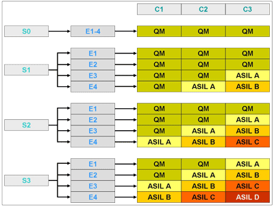

# ASIL in ISO 26262
From ISO 26262, ASIL (Automotive Safety Integrity Level) is used to classify the level of risk reduction required to ensure 
the safety of E/E systems in road vehicles, and helps determine the necessary safety measures to mitigate the potential 
hazards.
## ASIL Determination Matrix


### Legend

- **Severity (S)**
  - **S0**: No injuries
  - **S1**: Light and moderate injuries
  - **S2**: Severe and life-threatening injuries (survival probable)
  - **S3**: Life-threatening injuries (survival uncertain) or fatal injuries

- **Exposure (E)**
  - **E0**: Incredibly unlikely
  - **E1**: Very low probability
  - **E2**: Low probability
  - **E3**: Medium probability
  - **E4**: High probability

- **Controllability (C)**
  - **C0**: Controllable in general
  - **C1**: Simply controllable
  - **C2**: Normally controllable
  - **C3**: Difficult to control or uncontrollable

- **QM**: Quality Management (no specific safety requirements beyond normal quality processes)
- **ASIL A**: Basic safety measures
- **ASIL B**: Moderate safety measures
- **ASIL C**: Significant safety measures
- **ASIL D**: Most stringent safety measures
```SysML::Global
calc def calcASIL {
    in attribute severity:        ASIL { :>> min = 0; :>> max = 3;}
    in attribute exposure:        ASIL { :>> min = 0; :>> max = 4;}
    in attribute controllability: ASIL { :>> min = 0; :>> max = 3;}
    attribute    sum:             ASIL = severity + exposure + controllability;
    attribute    sumAdapted:      ASIL = if controllability == 0 ? 0 else if severity == 0 ? 0 else sum; 
    // special case for S0 and C0 the ASIL is always QM (0)
    return       result:          ASIL = max(sum-6,0);   ££
}  
```
## ASIL Decomposition
```SysML::Global
calc def calculateASILDecomposition{
    in attribute part1:              ASIL { :>> min = 0; :>> max = 4;}
    in attribute part2:              ASIL { :>> min = 0; :>> max = 4;}
    return       result:             ASIL = min(part1+part2, 4);
}
```
## CalcMTTF
```SysML::Global
calc def calcMTTF {
    in attribute lambda: SI::Frequency { :>> unit = [1/h];} 
    return       MTTF:   SI::Time = 1.0/lambda { :>> unit = [h];}   
}
```
## ASIL Calculation from Metrics
Different reliability metrics impact ASIL differently, all outlined in ISO 26262.

Precisely mentioned: SPFM, LFM.

Assumed based on ISO 26262 decription: all other.
## ASIL Metrics Table

| Metric                                | ASIL A       | ASIL B        | ASIL C         | ASIL D       |
|-------------------------------        |--------------|---------------|----------------|--------------|
| **Single Point Fault Metric**         | NA           | > 90%         | > 97%          | > 99%        |
| **Latent Fault Metric**               | NA           | > 60%         | > 80%          | > 90%        |
| **Diagnostic Coverage**               | NA           | > 90%         | > 97%          | > 99%        |
| **Mean Time To Failure (MTTF)**       | [1e3..1e4) h | [1e4..1e5) h  | [1e5..1e6) h   | [1e6..*) h   |
| **Mean Time To Repair (MTTR)**        | [12..72) h   | [2..12) h     | [0.7..2) h     | [0.0..0.7) h |
| **Mean Time Between Failures (MTBF)** | [1e3..1e4) h | [1e4..1e5) h  | [1e5..1e6) h   | [1e6..*) h   |
| **Availability**                      | NA           | > 99%         | > 99.5%        | > 99.9%      |
| **Reliability**                       | NA           | > 99%         | > 99.5%        | > 99.9%      |
| **Probability of Failure**            | [1..5) %     | [0.1..1) %    | [0.01..0.1) %  | [0..0.01) %  |
```SysML::Global
calc def ASIL_from_SPFM {
    in attribute SPFM_MPF: SI::Quantity  { :>> unit = "%";} 
    return level: ScalarValues::Integer = if SPFM_MPF > 99.0 [%] ? 4 else if SPFM_MPF > 97.0 [%] ? 3 else if SPFM_MPF > 90.0 [%] ? 2 else 1;
}
    
calc def ASIL_from_LFM {
    in attribute LFM: SI::Quantity  { :>> unit = "%";} 
    return level: ScalarValues::Integer = if LFM > 90.0 [%] ? 4  else if LFM > 80.0 [%] ? 3  else if LFM > 60.0 [%] ? 2 else 1;
}
    
calc def ASIL_from_DC {
    in attribute DC: SI::Quantity  { :>> unit = "%";} 
    return level: ScalarValues::Integer = if DC > 99.0 [%] ? 4 else if DC > 97.0 [%] ? 3 else if DC > 90.0 [%] ? 2 else 1;
}
    
calc def ASIL_from_MTTF {
    in attribute MTTF: SI::Time  { :>> unit = "h";} 
    return level: ScalarValues::Integer = if MTTF > 1e6 [h] ? 4 else if MTTF > 1e5 [h] ? 3 else if MTTF > 1e4 [h] ? 2 else if MTTF > 1e3 [h] ? 1 else 0;
}

calc def ASIL_from_MTBF {
    in attribute MTBF: SI::Time   { :>> unit = "h";} 
    return level: ScalarValues::Integer = if (MTBF > 1e6 [h]) ? 4 else if MTBF > 1e5 [h] ? 3 else if MTBF > 1e4 [h] ? 2 else if MTBF > 1e3 [h] ? 1 else 0;
}
     
calc def ASIL_from_MTTR {
    in attribute MTTR: SI::Time   { :>> unit = "h";} 
    return level: ScalarValues::Integer = if MTTR < 0.7 [h] ? 4 else if MTTR < 2.0 [h] ? 3 else if MTTR < 12.0 [h] ? 2 else if MTTR < 72.0 [h] ? 1 else 0;
}
 
calc def ASIL_from_Avail {
    in attribute Avail: SI::Quantity  { :>> unit = "%";} 
    return level: ScalarValues::Integer =  if Avail > 99.9 [%] ? 4 else if Avail > 99.5 [%] ? 3 else if Avail > 99.0 [%] ? 2 else 1;
}  
    
calc def ASIL_from_Reliab {
    in attribute Reliab: SI::Quantity { :>> unit = "%";} 
    return level: ScalarValues::Integer = if Reliab > 99.9 [%] ? 4 else if Reliab > 99.5 [%] ? 3 else if Reliab > 99.0 [%] ? 2 else 1;
}
    
calc def ASIL_from_ProbFail {
    in attribute ProbFail: SI::Quantity  { :>> unit = "%";} 
    return level: ScalarValues::Integer = if ProbFail < 0.01 [%] ? 4 else if ProbFail < 0.1 [%] ? 3 else if ProbFail < 1.0 [%] ? 2 else if ProbFail < 5.0 [%] ? 1 else 0;
}
```
## Definition of microcontrollers
```SysML::Global
package controllers {
    part def Controller {
        attribute failureRate: SI::Frequency {:>> unit = "1/h"; :>> range = "0.000000001..1";}
        attribute MTTF: SI::Time = calcMTTF(failureRate) {:>> unit = "h";}
        attribute severity: ScalarValues::Integer {:>> range = "0..3";}       
        attribute exposure: ScalarValues::Integer {:>> range = "0..4";}
        attribute controllability: ScalarValues::Integer {:>> range = "0..3";}
        attribute ASIlFromMTTF: ScalarValues::Integer = ASIL_from_MTTF(MTTF) {:>> range = "0..4";}
        attribute ASILCalculated: ScalarValues::Integer = calcASIL(severity,exposure,controllability) {:>> range = "0..4";}
    }
    part def Controller1 :> Controller{
        attribute severity: ScalarValues::Integer = 1;     
        attribute exposure: ScalarValues::Integer = 4;
        attribute controllability: ScalarValues::Integer = 2;
        attribute failureRate: SI::Frequency = 0.000005 [1/h] {:>> unit = "1/h";}
    }
    
    part def Controller2 :> Controller{
        attribute severity: ScalarValues::Integer = 1;     
        attribute exposure: ScalarValues::Integer = 4;
        attribute failureRate: SI::Frequency = 0.00005 [1/h] {:>> unit = "1/h";}
    }
    // Propagation of ASIL Level to Failure rate ... 
    attribute combinedASILFailureRate: ScalarValues::Integer = calculateASILDecomposition(Controller1::ASIlFromMTTF, Controller2::ASIlFromMTTF);

    // Propagation of Failure rate from ASIL Level that is constrainte     
    attribute combinedASILCalculated: ScalarValues::Integer = calculateASILDecomposition(Controller1::ASILCalculated, Controller2::ASILCalculated) {:>> range = "3..3";}
}
```
